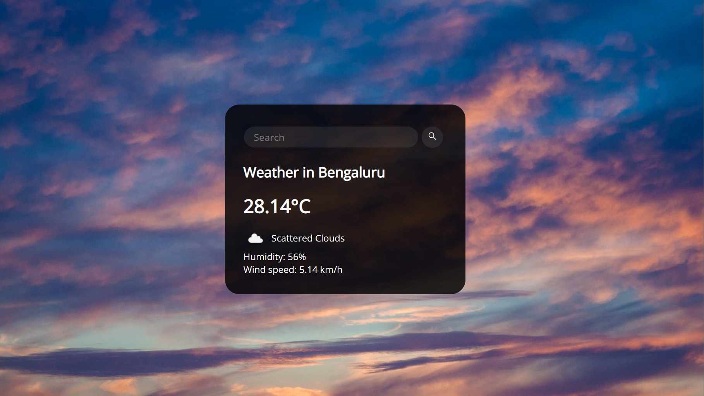

# Weather App

This is a simple weather application that allows you to search for and display weather information for a specific city. The app is built using HTML, CSS, and JavaScript.



## Features

- Search for weather information for a specific city.
- Display the current temperature, weather description, humidity, and wind speed.
- Dynamically update the background image based on the weather description.
- Responsive design for various screen sizes.

## Getting Started

To use the Weather App, follow these steps:

1. Clone the repository to your local machine or download the ZIP file.
2. Open the `index.html` file in your web browser.


## Usage

1. Open the app in your web browser.
2. In the search bar, enter the name of the city for which you want to check the weather.
3. Press the "Search" button or press Enter.
4. The app will display the current weather information for the specified city.

## Technologies Used

- HTML: The structure of the web page.
- CSS: Styling and layout of the app.
- JavaScript: Fetches weather data from the OpenWeatherMap API and updates the UI.

## API Key

To use the OpenWeatherMap API, you'll need to sign up and obtain an API key. Replace `'API_KEY'` in the `script.js` file with your actual API key.

```javascript
let weather = {
  apiKey: 'YOUR_API_KEY', // Replace with your actual API key
  // ...
};
```

## Credits

- Weather icons provided by [OpenWeatherMap](https://openweathermap.org/weather-conditions).


---

Feel free to contribute to and modify this Weather App project as you see fit. If you encounter any issues or have suggestions for improvements, please [open an issue](https://github.com/your-username/your-repo/issues) on GitHub. Enjoy using the app!
